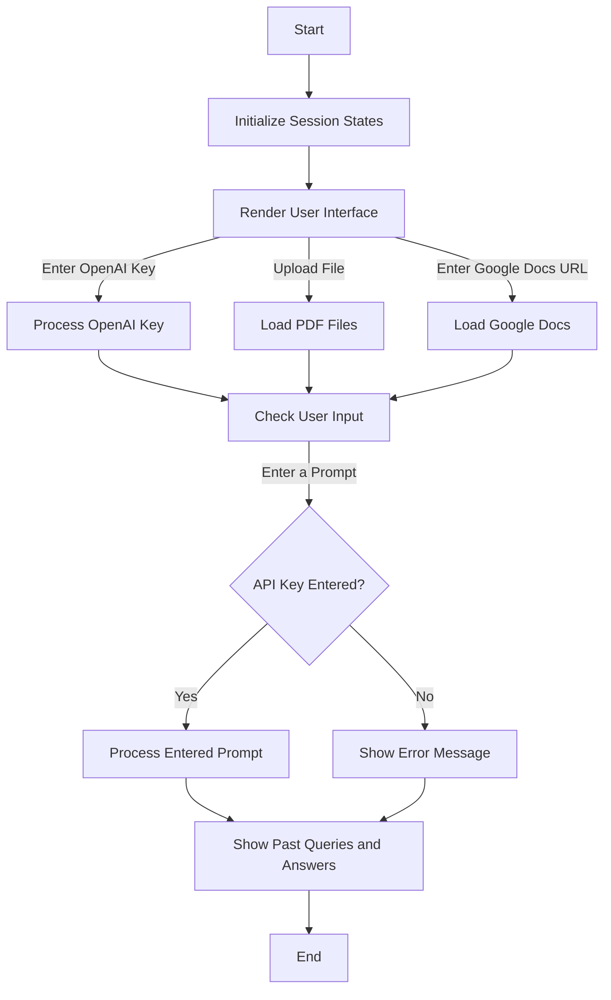

# LangChain Document Analysis App (PDF File + Google Docs supported)

Documentation to help setup and run the LangChain Document Analysis App. The app uses langchain ConversationalRetrievalChain with ChromaDB and PyPDF2 to load, store, and analyze pdf files. Google Docslinks are also supported with GoogleDriveLoader from LangChain, requiring additional setup via OAuth2. 

Interface is designed with Streamlit, and a version of this application without Google Docs support is [publically deployed](https://spycoderyt-langchaindocanalysis-streamlit-app-fmgu30.streamlit.app/). As of this point, Google Docs support is only available on the locally hosted version (due to needing to generate a credentials.json and token.json file for OAuth2), but I will try to make it publicly deployed ASAP!

# Prerequisites 
- Python 3.6 or later 
- OpenAI API key
- (for Google Docs support) Google Cloud Platform (GCP) account with a project
# Startup 🚀
1. Create a virtual environment `python -m venv lcdocsenv`
2. Activate it:
   - Windows:`.\lcdocsenv\Scripts\activate`
   - Mac:  `source lcdocsenv/bin/activate`
3. Clone this repo: `git clone https://github.com/spycoderyt/langchaindocanalysis`
4. Go into the directory `cd langchaindocanalysis`
5. Install necessary Python packages using pip:  `pip install -r requirements.txt `
6. Start the app `streamlit run streamlit_app.py`
# Startup continued (for GDocs Support)
1. Have an existing Google Cloud Project or [create a new one](https://console.cloud.google.com/cloud-resource-manager): 
2. Enable the [Google Drive API](https://console.cloud.google.com/flows/enableapi?apiid=drive.googleapis.com)
3. [Authorize credentials](https://developers.google.com/drive/api/quickstart/python#authorize_credentials_for_a_desktop_application) for a desktop application
4. Move the secret credentials .json file to the `langchaindocanalysis` directory
5. Run the script to generate a token.json file `python setup_gdrive_api.py`. You won't have to sign-in again as long as this file exists in your project directory.
6. Start the app `streamlit run streamlit_app.py`
# Customization
- You can change the OpenAI GPT Model in line 41 of streamlit_app.py.
- Feel free to send a pull request for bug fixes and adding additional features :)
# References  🔗
LG Chain used: [ConversationalRetrievalChain](https://python.langchain.com/en/latest/modules/chains/index_examples/chat_vector_db.html)

Inspiration: [nicknochnack's Leveraging Your Own Documents in a Langchain Pipeline](https://github.com/nicknochnack/LangchainDocuments)

[Langchain Library](https://github.com/langchain/langchain)

[GCP Credentials](https://cloud.google.com/docs/authentication/getting-started)

[Streamlit](https://streamlit.io/docs/)

[OpenAI API](https://beta.openai.com/docs/)

# Info
👨🏾‍💻 Author: Jirat Chiaranaipanich
